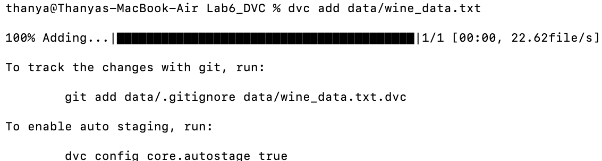
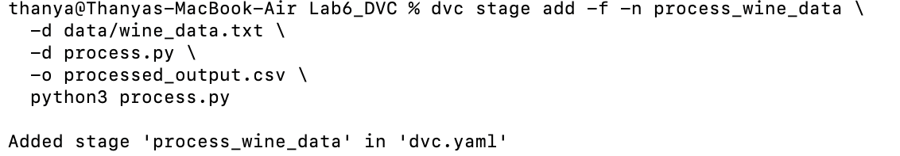
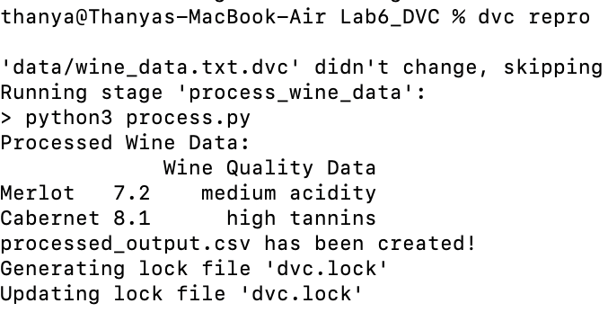

#  Lab 6 – Data Version Control (DVC) Pipeline (Wine Dataset)

This lab demonstrates how to use DVC (Data Version Control) to track datasets and create reproducible pipelines. 

##  1. Overview

DVC is a tool used to:
* Track large datasets
* Version data alongside code
* Build reproducible machine learning pipelines

In this lab:
* A new dataset (wine_data.txt) was created
* A processing script (process.py) was written
* A DVC pipeline stage was built and executed
* The entire workflow was tracked using Git + DVC
* No cloud storage was used (local-only pipeline)


##  2. Project Structure

```
Lab6_DVC/
│
├── data/
│   ├── wine_data.txt
│   └── wine_data.txt.dvc
│
├── processed_output.csv
├── process.py
├── dvc.yaml
├── dvc.lock
│
├── .dvc/
├── images
└── README.md
```

##  3. Custom Dataset


`data/wine_data.txt`

```
wine_name,quality,notes
Merlot,7.2,medium acidity
Cabernet Sauvignon,8.1,high tannins
Pinot Noir,7.8,light body
```

##  4. Initialize DVC

Inside the lab folder:

```bash
dvc init
```

DVC created:
* `.dvc/`
* `.dvcignore`

##  5. Track the Dataset

The dataset was added to DVC tracking:

```bash
dvc add data/wine_data.txt
```

This generated:
* `data/wine_data.txt.dvc`
* `data/.gitignore`

Then committed to Git:

```bash
git add data/.gitignore data/wine_data.txt.dvc .dvcignore .dvc/
git commit -m "Added wine dataset and enabled DVC tracking"
```

##  6. Custom Processing Script

The processing script reads the dataset and generates a processed CSV.

`process.py`:

```python
import pandas as pd

df = pd.read_csv("data/wine_data.txt")

print("Processed Wine Data:")
print(df)

df.to_csv("processed_output.csv", index=False)

print("processed_output.csv has been created!")
```

##  7. Create a DVC Pipeline Stage

Using modern DVC syntax:

```bash
dvc stage add -n process_wine_data \
  -d data/wine_data.txt \
  -d process.py \
  -o processed_output.csv \
  python3 process.py
```

This created:
* `dvc.yaml`
* (after repro) `dvc.lock`

Commit the stage:

```bash
git add dvc.yaml process.py
git commit -m "Added custom DVC pipeline stage"
```

##  8. Run the Pipeline

Reproduce the pipeline:

```bash
dvc repro
```

This:
* Detected dependencies
* Ran the script
* Created `processed_output.csv`
* Generated `dvc.lock`

Commit the final files:

```bash
git add dvc.lock processed_output.csv
git commit -m "Pipeline output and lockfile added"
```

##  9. Results

This lab demonstrates:

✔ Custom dataset creation  
✔ Data versioning with DVC  
✔ Custom Python processing stage  
✔ Reproducible pipeline with `dvc repro`  
✔ Full Git + DVC integration  
✔ Satisfies "must modify the lab" requirement

##  10. Screenshots 


**▪ Dataset Added**

```markdown

```

**▪ Stage Created**

```markdown

```

**▪ Pipeline Run (dvc repro)**

```markdown

```
---
